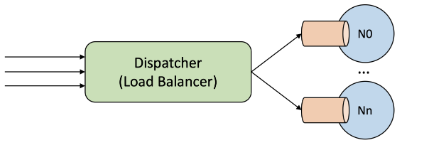

# Task Dispatcher

## Description

The `Task Dispatcher` is acting as the system's load balancer, is managing the flow of incoming tasks to the data center. It serves as the primary entry point for tasks, determining their optimal distribution across available computing nodes based on a set of predefined scheduling policies.

    

## Core Actions

- **Scheduling Policy Enforcement**: Decide the best-suited node for task execution, taking into account factors such as node load, task priority, and the specific criteria defined by the policies.
- **Task Reception**: Frontline receiver of all incoming tasks, clients of the data center or other external incomings.
- **Task Distribution**: Forwards tasks to host nodes for execution, balance the load efficiently across the data center.

## Round Robin (`RR`)

The `RR` scheduling policy ensures a **fair distribution** of tasks among all nodes by sequentially assigning tasks in a cyclical manner. This policy ***transmits to every node*** an equal number of tasks over time, promoting a balanced workload distribution across the data center.

- **Task Allocation**: Distributes tasks cyclically in fixed order, each node receives a task before repeating the cycle.
- **Fairness**: Ensures an equal distribution of tasks across nodes, beneficial for tasks with uniform execution times.
- **Simplicity**: Easy to implement without the need for complex allocation calculations.

## Shortest Queue (`SQ`)

The `SQ` policy is used to **minimize wait times** by allocating tasks to the node with the smallest queue of waiting and executing tasks. This ***policy distributes tasks*** in a manner that keeps queue lengths as short as possible, thereby reducing the overall wait time for tasks to be executed.

- **Task Allocation**: New tasks are assigned to nodes with no tasks first, to evenly distribute the workload.
- **Fairness**: Considers both executing and waiting tasks to accurately assess a node's workload.
- **Tie-Breaking**: When multiple nodes have equal queue lengths, tasks go to the node with the **lowest ID**.

## Least Work Left (`LWL`)

The `LWL` policy **prioritizes nodes** based on the *least amount of pending work*, which is calculated by summing the durations of all tasks in the queue as well as the one currently being executed. This ***strategy aims to balance***  the workload by focusing on the total work left rather than just the number of tasks.

- **Task Allocation**: Assigns tasks to the node with the least amount of work left, optimizing throughput, priortize tasks based on there duration, reduce idle times.
- **Fairness**: Includes both executing and queued tasks for accurate workload assessment.
- **Efficiency**: Focuses on quick task completion for faster turnover and better resource utilization.

## Size Interval Task Assignment (`SITA`)

The `SITA` scheduling policy categorizes tasks into three sizes: **short**, **medium**, and **long**. It assigns tasks to one of three specific nodes based on their size, with each node specialized in handling a particular category of task sizes. This ***policy aims to optimize*** task processing by tailoring node capabilities to task requirements.

- **Task Allocation**: Assigns tasks to nodes (`0` for *short*, `1` for *medium*, `2` for *long*) based on size.
- **Fairness**: Sorts tasks into **short**, **medium**, and **long** based on complexity or duration.
- **Optimized Processing**: Boost efficiency and throughput, optimezed for the most likely task types to encounter.

## Architectural Role

The **dispatcher** is the critical link between task **reception and execution** within the system. It is responsible for routing tasks based on efficient algorithms and adapting to the dynamic conditions of the system.

- **Task Routing**: Analyzes the current state of compute nodes to route tasks to the most appropriate node.
- **Feedback Loop**: Receives feedback on node performance and load, refining its scheduling decisions.
- **Adaptability**: Adjusts scheduling strategies in response to changing conditions within the data center.

## Java Threads

The key for implementing the `Task Dispatcher` and compute nodes include:

- **Concurrency Control**: Thread-safe across the system, crucial for task management and node interaction.
- **Priority Management**: Tasks commence execution or halt based on priority and preemption flag values.
- **Efficiency Optimization**: Improve task distribution, resource utilization, and speed up task completion.
